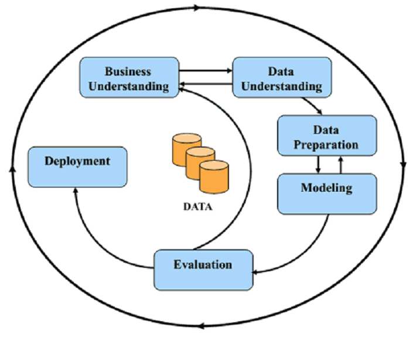

# machine-learning

Lesson 1

1. **Machine Learning** is a branch of **AI** where using data we can make machines to *imitate* the *human learning process*. Here we give ML, ***features***(all the data about a product) and ***targets***(all information how results should be), and then those are fitted into a model to predict the ***outcome***(Predicted value of results).
2. **Rule based system VS Mchine Learning**
    - In rule based system we used to program some ***rule base conditions***, after executing the program it returns a result based on the rules. But it was a kind of hardcoded system where if a content gets in a category of a rule then it is sure to be resulted in that category. i.e. if we are building a spam detection system then even if a good email contains one of rules then the program will detect it as a spam. Whereas, though ML is ***not 100% accurate*** and it also have some rules, it can detect spam accurately to certain level of precesion. Aslo, now ***the system is not completely bounded by rules***, meaning even if a good email contains one or two elements of spam doesn’t mean it will end up in spam.
    - In rule based system we **input data and code(hardcoded rules)** into a software and the **results get outputed.** On the other hand, in ML we **input our data and outcome(Spam or Not)** into ML algorithm and **a model comes out as an outcome**, this process is called **training**. After that, we can predict outcomes for new and unknown data.
3. **Supervised Learning**
    - Supervised Machine Learning is ***an algorithm that learns from labeled training data to help you predict outcomes for unforeseen data***.
    - $g(X) \approx y$ ; where $g$ is ***the model***, $X$ is ***feature matrix,*** $y$ is ***target matrix***. We want to train the model as such so that $g(X)$  can be ***approximately very close*** to $y$.
    - Type of supervised learning
        - ************************************Regrassion model:************************************ Determining the price of something.
        - ********************************************Classification model:******************************************** Determining the category of something. Types are:
            - Multiclass. Where we can classify more than two objects.
            - Binary. Where we can classify two objects.
        - ******************Ranking model:****************** A classification model that ranks products for suggestion. Like Search engine search results, e-commarce product suggestions.
4. **CRISP-DM:** Croos-Industry Standard Process for Data Mining is a model for data mining.

    
- ************************************************Business Understanding:************************************************ Identify the business problem, understand how we can solve it ***(Define the goal)***. Determine how to measure the success of our project ***(Measure the goal)***.
    - Do we really need ML? A lot of time we can just solve problems by rules-based system.
- **************************************************Data Understanding:************************************************** Analyze the data sources to know creadibility. ********************(Identify the data sources)********************
    - Is the process of collecting data working?
    - Is the data good enough?
    - Is it reliable?
    - Do we track it correctly?
    - Is the dataset large enough?
    - Do we need more data?
    
    ********************Note:******************** New data can influence the goal so we can go back and forth to first step.

